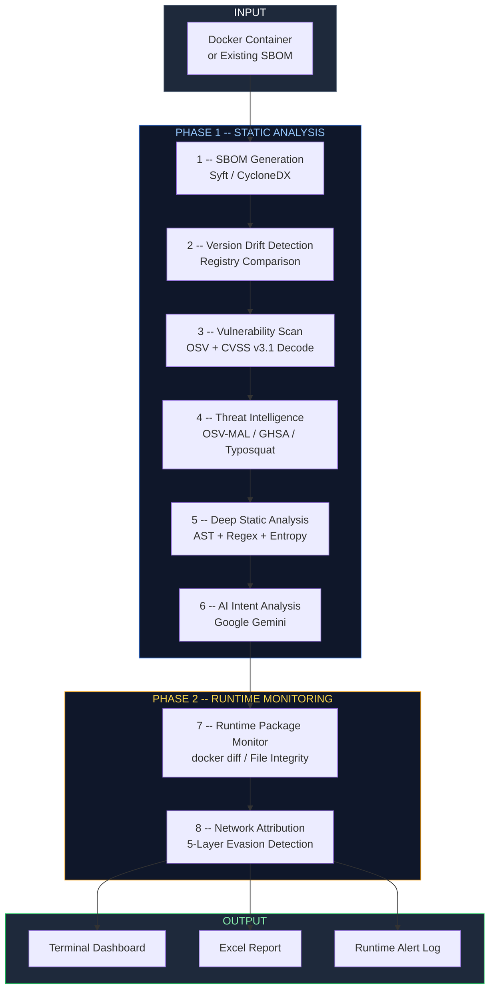
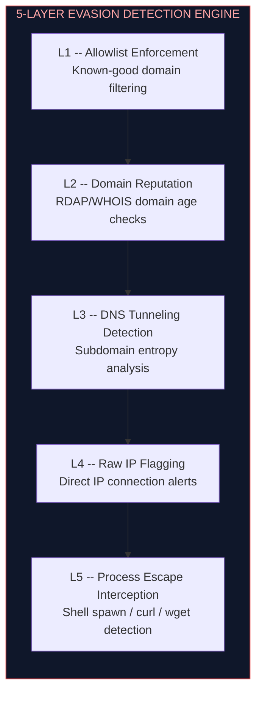
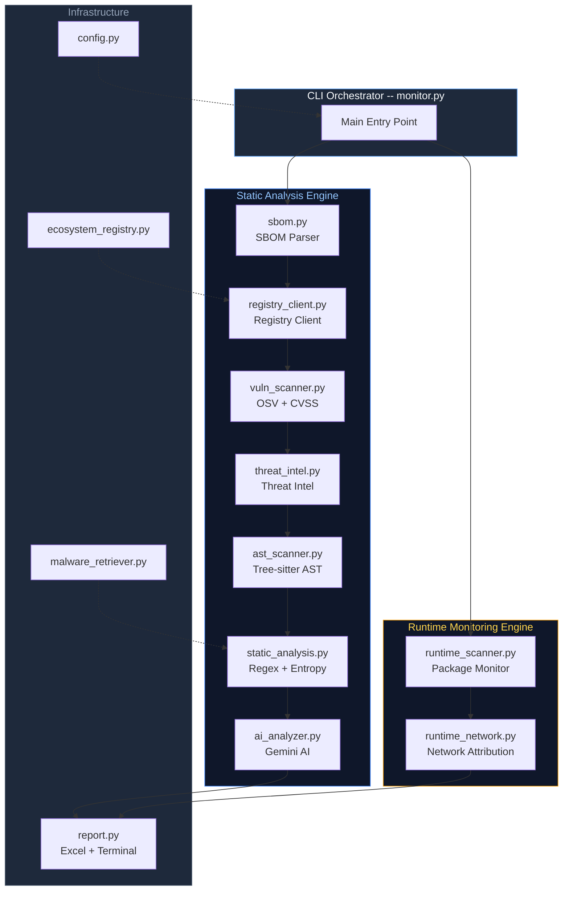

<div align="center">

# Supply Chain Sentinel

**AI-Powered, Multi-Layered Software Supply Chain Security Platform**

Detect malicious open-source dependencies before they detonate. Static analysis, threat intelligence, AI intent analysis, and live container runtime monitoring — unified in a single pipeline.

[](https://www.python.org/)
[](LICENSE)
[](https://www.docker.com/)
[]()
[](https://ai.google.dev/)
[](https://cyclonedx.org/)

---

> *"Standard SCA tools tell you what vulnerabilities exist. Supply Chain Sentinel tells you what the code is actually trying to do."*

</div>

---

## The Problem

Software supply chain attacks are the fastest-growing threat vector in cybersecurity. Tools like Trivy, Snyk, and Dependabot rely on **known CVE databases** -- they are blind to:

- **Zero-day malware** with no CVE assigned yet
- **Typo-squatting** packages designed to mimic popular libraries
- **Obfuscated payloads** hidden in install scripts
- **Runtime evasion** techniques that activate only inside containers

Supply Chain Sentinel was built to close that gap.

---

## How It Works

The platform runs every dependency through an **8-stage security funnel** spanning two phases: pre-runtime static analysis and live container monitoring.



---

## Pipeline Stages

### Phase 1: Static Analysis (Pre-Runtime)

| Stage | Name | Description |
|:-----:|------|-------------|
| **1** | **SBOM Generation** | Generates CycloneDX JSON bills of materials from Docker images via Syft. Supports **8 ecosystems**: PyPI, npm, Go, RubyGems, Maven, crates.io, Packagist, NuGet. |
| **2** | **Version Drift Detection** | Queries each ecosystem's live package registry API to compare installed versions against latest available releases. Flags outdated and potentially abandoned packages. |
| **3** | **Vulnerability Scanning** | Queries the Google OSV database for known CVEs. Dynamically decodes **CVSS v3.1 vector strings** using the official FIRST.org mathematical formula to calculate per-CVE severity scores. The overall package score reflects the **maximum severity** across all associated CVEs. |
| **4** | **Threat Intelligence** | Cross-references packages against multiple threat databases: OSV Malware (`MAL-` prefixed advisories), GitHub Security Advisories (`GHSA-`), a local blocklist of known compromised packages, and **typo-squatting detection** via Levenshtein distance analysis against popular package catalogs. |
| **5** | **Deep Static Analysis** | Uses **Tree-sitter AST parsing** (Python, JavaScript, Go, Ruby) combined with regex pattern matching to scan raw source code for: Base64 payloads, dynamic `eval`/`exec`, credential harvesting (AWS keys, environment variables), hardcoded IPs/URLs, crypto wallet addresses, **Shannon entropy-based** secret detection, and code obfuscation patterns. |
| **6** | **AI Intent Analysis** | Suspicious code snippets flagged by the AST scanner are forwarded to **Google Gemini AI** for semantic intent analysis. The model returns a verdict (`MALICIOUS` / `SUSPICIOUS` / `BENIGN`), a confidence score, and a natural-language intent summary explaining *what the code is trying to do*. |

### Phase 2: Live Runtime Monitoring (HIDS)

| Stage | Name | Description |
|:-----:|------|-------------|
| **7** | **Runtime Package Monitor** | Continuously monitors running containers for unauthorized package installations or file modifications using `docker diff`. Detects post-deployment supply chain injection. |
| **8** | **Network Attribution** | 5-layer evasion detection engine operating on live container network sockets. |

#### Network Evasion Detection Layers



---

## Comparison with Industry Tools

> Supply Chain Sentinel is not a replacement for vulnerability scanners -- it is the **layer that catches what they miss**.

| Capability | Supply Chain Sentinel | Trivy | Snyk | Dependabot |
|:-----------|:---------------------:|:-----:|:----:|:----------:|
| Known CVE Detection | Yes | Yes | Yes | Yes |
| CVSS v3.1 Vector Decoding | Yes | Partial | Partial | No |
| Zero-Day / No-CVE Malware | **Yes** | No | No | No |
| Typo-Squatting Detection | **Yes** | No | No | No |
| AST-Level Code Analysis | **Yes** | No | No | No |
| AI Semantic Intent Analysis | **Yes** | No | No | No |
| Shannon Entropy Scanning | **Yes** | No | No | No |
| Live Container Runtime HIDS | **Yes** | No | No | No |
| Network Evasion Detection | **Yes** | No | No | No |
| Multi-Ecosystem SBOM | Yes | Yes | Yes | Partial |
| Threat Intel Cross-Reference | **Yes** | Partial | Partial | Partial |
| Excel Reporting + AI Summary | **Yes** | No | No | No |
| Fully Offline Capable | Partial | Yes | No | No |
| Free / Open Source | **Yes** | Yes | Freemium | Free |

---

## Quick Start

### Prerequisites

| Requirement | Purpose |
|:------------|:--------|
| **Python 3.9+** | Core runtime |
| **Docker Desktop** | Container analysis target (must be running) |
| **[Syft CLI](https://github.com/anchore/syft)** | SBOM generation from container images |
| **Gemini API Key** | AI intent analysis (set `GEMINI_API_KEY` env var) |

> **Tip:** The `GEMINI_API_KEY` environment variable supports comma-separated multiple keys for automatic rotation under rate limits.

### Installation

```bash
# Clone the repository
git clone https://github.com/Vighnesh-07/supply-chain-sentinel.git
cd supply-chain-sentinel

# Install Python dependencies
cd monitor
pip install -r requirements.txt
```

### Build the Demo Target

```bash
# Build the demo Node.js application with intentionally malicious dependencies
docker build -t nexus-studio-app -f demo-apps/nexus-studio/Dockerfile demo-apps/nexus-studio

# Start the target container
docker run -d --name nexus-studio-app -p 3000:3000 nexus-studio-app
```

### Run a Security Audit

```bash
# Full static analysis pipeline (Stages 1-6)
python monitor.py --container nexus-studio-app

# Full pipeline + live runtime monitoring (Stages 1-8)
python monitor.py --container nexus-studio-app --watch --net-monitor

# Scan ALL running containers
python monitor.py --container all --watch

# Use a pre-generated SBOM file
python monitor.py --skip-sbom --sbom-file existing_sbom.json
```

### Output Locations

| Output | Location |
|:-------|:---------|
| Terminal Dashboard | Rich color-coded terminal output |
| Excel Report | `reports/<container>/supply_chain_audit_YYYYMMDD_HHMMSS.xlsx` |
| Runtime Alerts | `monitor/runtime_alerts.log` |

---

## Supported Ecosystems

| Ecosystem | Registry | Languages |
|:----------|:---------|:----------|
| **PyPI** | pypi.org | Python |
| **npm** | registry.npmjs.org | JavaScript, TypeScript |
| **Go Modules** | proxy.golang.org | Go |
| **RubyGems** | rubygems.org | Ruby |
| **Maven Central** | search.maven.org | Java, Kotlin, Scala |
| **crates.io** | crates.io | Rust |
| **Packagist** | packagist.org | PHP |
| **NuGet** | nuget.org | C#, F#, .NET |

---

## Architecture

Detailed architecture documentation is organized into focused design documents in the [`docs/`](docs/) directory:

| Document | Scope |
|:---------|:------|
| [`01-system-overview.md`](docs/01-system-overview.md) | High-level system design and data flow |
| [`02-sbom-and-vulnerability.md`](docs/02-sbom-and-vulnerability.md) | SBOM generation, version drift, CVSS decoding |
| [`03-threat-intelligence.md`](docs/03-threat-intelligence.md) | Multi-database threat intel and typo-squatting |
| [`04-static-analysis-and-ai.md`](docs/04-static-analysis-and-ai.md) | AST scanning, entropy analysis, Gemini integration |
| [`05-runtime-monitoring.md`](docs/05-runtime-monitoring.md) | Container HIDS and network evasion engine |

### System Architecture



---

## Project Structure

```
supply-chain-sentinel/
|-- docs/                           # Architecture documentation
|   |-- 01-system-overview.md
|   |-- 02-sbom-and-vulnerability.md
|   |-- 03-threat-intelligence.md
|   |-- 04-static-analysis-and-ai.md
|   |-- 05-runtime-monitoring.md
|-- demo-apps/                      # Target test applications
|   |-- nexus-studio/               #   Node.js microservice with demo deps
|       |-- preload.cjs             #   Memory hooking instrumentation engine
|       |-- Dockerfile
|-- demo-packages/                  # 12 custom malicious test packages
|   |-- b64-encoder/                #   Base64 payload dropper
|   |-- cloud-exfil/                #   Cloud credential exfiltration
|   |-- cmd-implant/                #   Command injection implant
|   |-- crypt-loader/               #   Encrypted payload loader
|   |-- data-stealer/               #   Data theft package
|   |-- env-harvester/              #   Environment variable harvester
|   |-- fs-backdoor/                #   Filesystem backdoor
|   |-- hex-beacon/                 #   Hex-encoded C2 beacon
|   |-- net-phantom/                #   Stealthy network communication
|   |-- nexus-formatter/            #   Disguised malicious formatter
|   |-- wallet-drainer/             #   Cryptocurrency wallet drainer
|   |-- webhook-spy/                #   Webhook data exfiltration
|-- monitor/                        # Core security scanner engine
|   |-- monitor.py                  #   Main CLI orchestrator
|   |-- requirements.txt
|   |-- utils/
|       |-- config.py               #   Configuration and thresholds
|       |-- sbom.py                 #   SBOM parser (multi-ecosystem)
|       |-- registry_client.py      #   Universal package registry client
|       |-- vuln_scanner.py         #   OSV scanner + CVSS v3.1 decoder
|       |-- threat_intel.py         #   Multi-database threat intel engine
|       |-- static_analysis.py      #   Deep static + entropy scanner
|       |-- ast_scanner.py          #   Tree-sitter AST analysis
|       |-- ai_analyzer.py          #   Gemini AI intent analysis
|       |-- runtime_scanner.py      #   Container runtime package extractor
|       |-- runtime_network.py      #   Network parser + 5-layer evasion
|       |-- ecosystem_registry.py   #   Multi-ecosystem registry definitions
|       |-- malware_retriever.py    #   Malware sample retrieval
|       |-- report.py               #   Excel report + terminal summary
|-- docker-compose.yml
|-- CONTRIBUTING.md
|-- SECURITY.md
|-- LICENSE                         # MIT License
|-- README.md
```

---

## Demo Malware Test Suite

The repository includes **12 purpose-built malicious packages** that simulate real-world supply chain attack techniques. Each package targets a different attack vector:

| Package | Attack Vector | Technique |
|:--------|:--------------|:----------|
| `b64-encoder` | Payload Delivery | Base64-encoded payload dropper |
| `cloud-exfil` | Data Exfiltration | Cloud credential theft via API |
| `cmd-implant` | Remote Access | Command injection implant |
| `crypt-loader` | Evasion | Encrypted/obfuscated payload loader |
| `data-stealer` | Data Theft | Generic data exfiltration |
| `env-harvester` | Credential Theft | Environment variable harvesting |
| `fs-backdoor` | Persistence | Filesystem-level backdoor |
| `hex-beacon` | C2 Communication | Hex-encoded command-and-control beacon |
| `net-phantom` | Stealth Networking | Covert network communication |
| `nexus-formatter` | Social Engineering | Disguised as a legitimate formatter |
| `wallet-drainer` | Financial Theft | Cryptocurrency wallet drainer |
| `webhook-spy` | Data Exfiltration | Webhook-based data exfiltration |

> **IMPORTANT DISCLAIMER:**
> The packages in `demo-packages/` contain **intentionally malicious code** created solely for testing and educational purposes. They are designed to be detected by Supply Chain Sentinel's analysis pipeline. **Do NOT install, execute, or deploy these packages outside of the provided Docker test environment.** They are not published to any public registry. Use at your own risk in isolated environments only.

---

## Tech Stack

| Component | Technology | Role |
|:----------|:-----------|:-----|
| Core Runtime | **Python 3.9+** | Pipeline orchestration and analysis |
| Containerization | **Docker** | Target container management |
| SBOM Generation | **Syft** | CycloneDX bill of materials |
| AI Analysis | **Google Gemini** | Semantic code intent analysis |
| AST Parsing | **Tree-sitter** | Multi-language abstract syntax trees |
| Terminal UI | **Rich** | Color-coded dashboard rendering |
| Reporting | **OpenPyXL** | Professional Excel report generation |

---

## CVSS Scoring Methodology

Supply Chain Sentinel implements the **official FIRST.org CVSS v3.1 specification** for vulnerability scoring:

1. Raw CVSS v3.1 vector strings are retrieved from the Google OSV API for each CVE.
2. Each vector is decoded into its component metrics (Attack Vector, Complexity, Privileges Required, User Interaction, Scope, Confidentiality, Integrity, Availability).
3. Base scores are calculated using the **official FIRST.org mathematical formula**.
4. Each CVE receives its own individually calculated score and severity classification.
5. The **overall package score** displayed in reports reflects the **maximum severity** across all CVEs associated with that package.

| Score Range | Severity |
|:------------|:---------|
| 0.0 | None |
| 0.1 -- 3.9 | Low |
| 4.0 -- 6.9 | Medium |
| 7.0 -- 8.9 | High |
| 9.0 -- 10.0 | Critical |

---

## Contributing

Contributions are welcome. Please read [`CONTRIBUTING.md`](CONTRIBUTING.md) before submitting a pull request.

1. Fork the repository
2. Create a feature branch (`git checkout -b feature/new-detection-layer`)
3. Commit your changes (`git commit -m "Add new detection layer"`)
4. Push to the branch (`git push origin feature/new-detection-layer`)
5. Open a Pull Request

For security vulnerabilities, please follow the responsible disclosure process in [`SECURITY.md`](SECURITY.md).

---

## Star History

If you find this project useful, consider giving it a star -- it helps others discover it.

[](https://star-history.com/#Vighnesh-07/supply-chain-sentinel&Date)

---

## License

MIT License -- Copyright (c) 2026 Vighnesh

See [`LICENSE`](LICENSE) for the full license text.

---

<div align="center">

**Supply Chain Sentinel** -- Because `npm install` should not be an act of faith.

</div>
