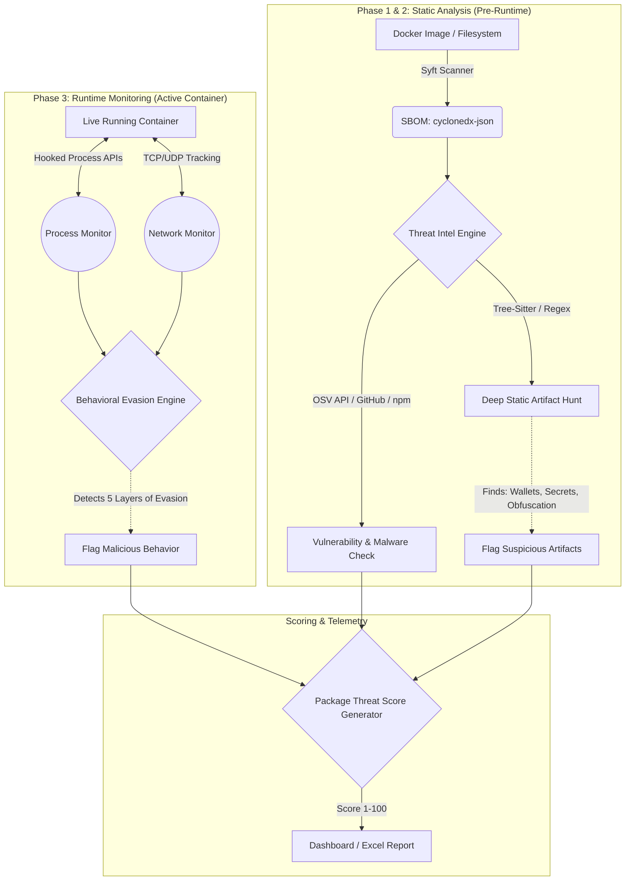
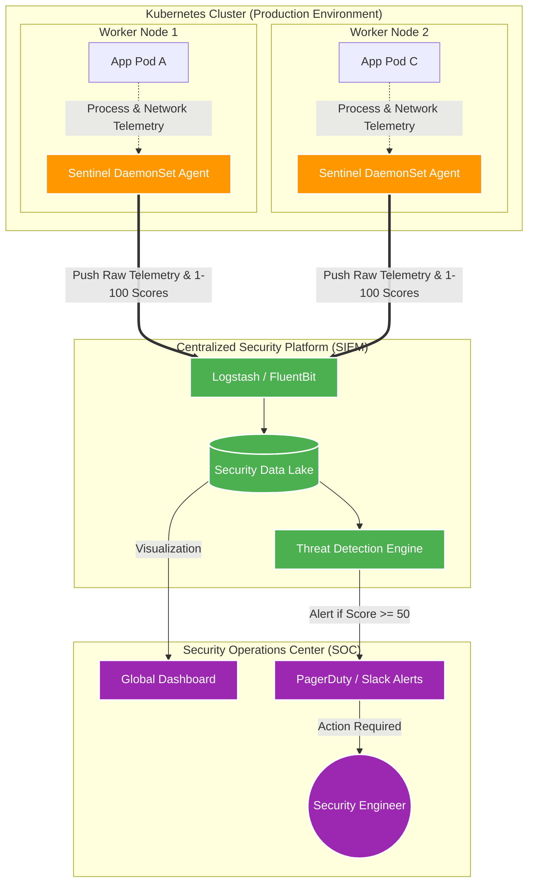

# Supply Chain Sentinel — Complete Architecture

Supply Chain Sentinel is an end-to-end security platform designed to detect and neutralize malicious open-source dependencies. It combines static image analysis, deep artifact hunting, and a real-time behavioral Host-based Intrusion Detection System (HIDS).

Below is the complete architectural breakdown of the system.

---

## 1. The Core Pipeline Flow

The Sentinel operates in two distinct modes: **Static Auditing (Pre-Deployment)** and **Active Watch (Runtime)**.

---

## 2. The 1-100 Threat Scoring System

Instead of relying purely on binary (Clean/Malicious) flags, Sentinel calculates a weighted **Threat Score (1-100)** for every single package. 

*   **Vulnerability Points:** CVSS Score * 5
*   **Static Artifacts:** Crypto Wallets (+30), High-Entropy Secrets (+25), Suspicious AST Patterns (+15)
*   **Dynamic Evasion:** Critical Process Escapes (+80), DNS Anomalies (+60), Unauthorized Outbound Connections (+50)
*   **Threat Intel:** Known Malware direct hit (+100)

**Thresholds:**
*   **1:** **[Clean]** - Safe to deploy.
*   **2 - 49:** **[Suspicious]** - Requires human review (e.g., contains hardcoded URLs or IPs).
*   **50 - 100:** **[Malicious]** - Blocked. Severe behavioral evasion or known malware.

---

## 3. The 5-Layer Evasion Detection Architecture (HIDS)

Modern supply chain malware attempts to hide. Sentinel’s runtime engine utilizes 5 layers of detection to catch malware that tries to evade static scans:

1.  **L1 - Allowlist Enforcer:** Intercepts network traffic attempting to reach unauthorized external hosts (not in the standard ecosystem registry list).
2.  **L2 - Domain Reputation:** Scans resolved domains for age and threat intel (e.g., catching newly registered C2 domains).
3.  **L3 - DNS Anomalies:** Detects Fast-Flux DNS and Domain Generation Algorithms (DGAs).
4.  **L4 - Raw IP Connections:** Flags hardcoded IP connections that deliberately bypass DNS resolution.
5.  **L5 - Process Escapes:** Hooks into container runtimes (via `preload.cjs`, etc.) to intercept attempts to spawn reverse shells (`curl | bash`), execute LotL binaries (`wget`, `certutil`), or break out of the host process.

---

## 4. Production Kubernetes Deployment (Clean Architecture)

In a real-world enterprise environment, Sentinel shifts from a local CLI tool to a highly scalable, centralized architecture.

### Deployment Roles:
*   **The Collectors (DaemonSet Agents):** Sentinel runs as a highly privileged DaemonSet. Exactly one Sentinel runs on every Kubernetes worker node, mounting the host runtime socket (e.g., `containerd.sock`) to continuously monitor all application pods on that hardware.
*   **The Aggregator (SIEM):** Sentinel forwards all scores (1-100) and layer 1-5 evasion alerts via JSON to a centralized Security Information and Event Management (SIEM) system (like Datadog, Splunk, or Elastic).
*   **The User (SOC):** A DevSecOps engineer receives an automated PagerDuty or Slack alert if an application pod executes a malicious package (Score >= 50). They review the aggregated deep-scan artifacts on their dashboard and quarantine the pod.
