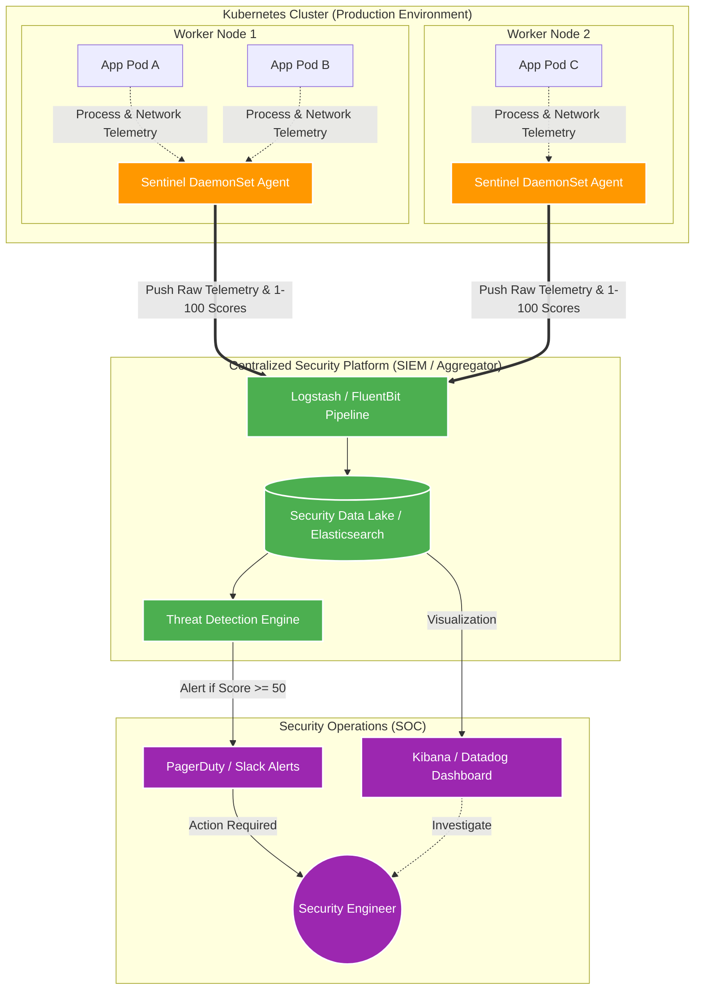
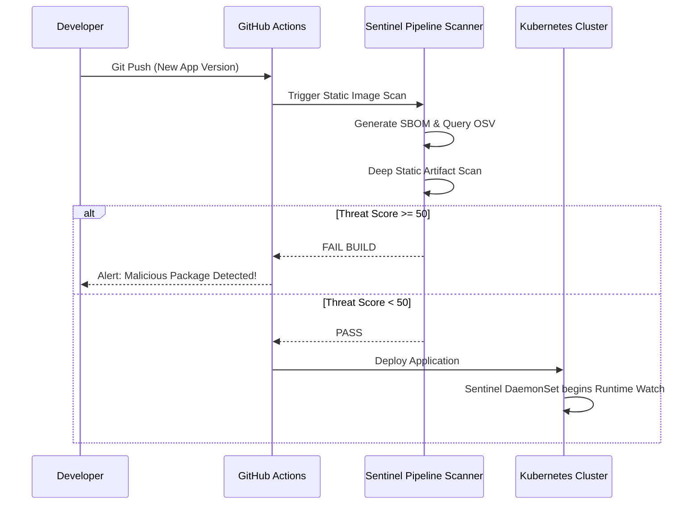

# Supply Chain Sentinel — Production Architecture

This document illustrates how Supply Chain Sentinel is deployed in a real-world enterprise Kubernetes environment. Rather than running locally on a developer's laptop, the tool shifts into a distributed, centralized model (Clean Architecture).

## 1. High-Level Production Flow

The architecture follows a strict separation of concerns:
1. **Data Collection (Edge):** The DaemonSet agents running on every node.
2. **Data Processing (Core):** The Central API / SIEM that aggregates alerts and calculates risk.
3. **Presentation (User):** The SOC Analyst Dashboard.

## 2. Component Breakdown

### A. The DaemonSet Agents (Data Collectors)
In Kubernetes, you deploy the Sentinel not as an app pod, but as a privileged **DaemonSet**. 
* **Placement:** Kubernetes guarantees exactly one Sentinel container runs on every single worker node.
* **Role:** It mounts the node's Docker/Containerd socket. It uses `monitor.py --watch` to monitor all other pods on that same node. It generates the `Package Threat Score (1-100)` and detects the 5 layers of evasion (DNS, Process Escapes, etc.).

### B. The Centralized SIEM (Data Aggregator)
The Sentinel agents do not store logs locally in production. Instead, they stream their findings (JSON payloads) to a centralized Security Information and Event Management (SIEM) system like Elastic Security, Datadog, or Splunk.
* **Role:** It stores all historical telemetry across the entire cluster. It allows engineers to search for IOCs (Indicators of Compromise) globally.

### C. The SOC User (Action Taker)
The end-user is a Security Engineer or DevSecOps professional.
* **Role:** They receive an automated Slack or PagerDuty alert triggered by the SIEM if any package crosses the `50` (Malicious) threshold. They review the Sentinel's deep-scan data on their dashboard and decide whether to quarantine the affected Kubernetes node or block the malicious package.

## 3. The CI/CD Pipeline (Pre-Deployment)

*Note: While the DaemonSet monitors runtime, Sentinel is also typically embedded in the CI/CD pipeline as an Admission Controller.*

