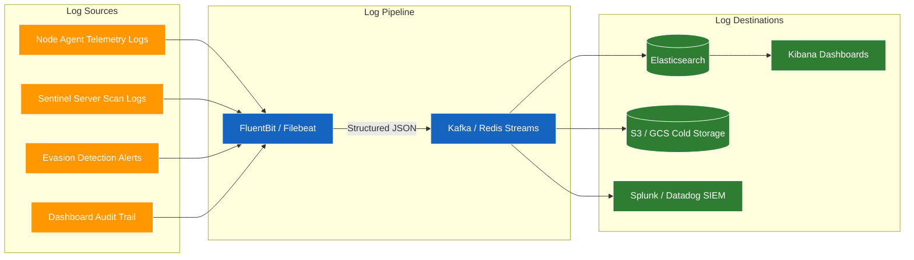
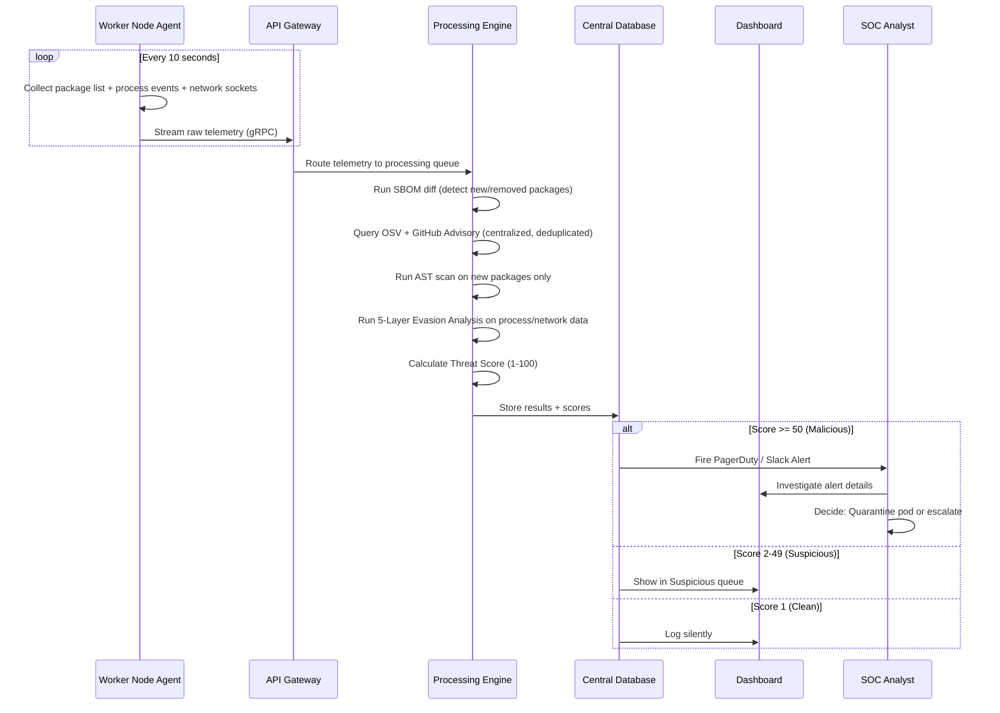

# Supply Chain Sentinel — Organization-Level Architecture

## The Problem

Running a full Sentinel engine (SBOM generation, OSV queries, deep artifact scanning, evasion analysis) on **every single Kubernetes worker node** is resource-intensive. Each node would duplicate the same threat intelligence queries, consume CPU for AST parsing, and maintain its own local logs. At organization scale (50-500+ nodes), this is unsustainable.

## The Solution: Centralized Sentinel Server + Lightweight Node Agents

Split the architecture into two tiers:
1. **Lightweight Collector Agents** on each node — they only gather raw telemetry (package lists, process events, network connections) and forward it.
2. **Centralized Sentinel Server** — a dedicated server that receives all telemetry, runs the heavy analysis (scoring, evasion detection, threat intel queries), stores logs, and serves a role-based dashboard.

---

## 1. Complete Organization-Level Architecture

```mermaid
graph TD
    classDef node fill:#37474f,stroke:#fff,stroke-width:2px,color:#fff;
    classDef agent fill:#ff9800,stroke:#fff,stroke-width:2px,color:#fff;
    classDef server fill:#1565c0,stroke:#fff,stroke-width:2px,color:#fff;
    classDef db fill:#2e7d32,stroke:#fff,stroke-width:2px,color:#fff;
    classDef dash fill:#7b1fa2,stroke:#fff,stroke-width:2px,color:#fff;
    classDef ext fill:#c62828,stroke:#fff,stroke-width:2px,color:#fff;

    subgraph "Kubernetes Cluster"
        subgraph "Worker Node 1":::node
            A1[App Pod A]
            A2[App Pod B]
            C1[Lightweight Collector Agent]:::agent
            A1 -.->|Raw Telemetry| C1
            A2 -.->|Raw Telemetry| C1
        end

        subgraph "Worker Node 2":::node
            A3[App Pod C]
            A4[App Pod D]
            C2[Lightweight Collector Agent]:::agent
            A3 -.->|Raw Telemetry| C2
            A4 -.->|Raw Telemetry| C2
        end

        subgraph "Worker Node N":::node
            AN[App Pod X]
            CN[Lightweight Collector Agent]:::agent
            AN -.->|Raw Telemetry| CN
        end
    end

    subgraph "Sentinel Central Server"
        C1 ===>|gRPC / HTTPS Stream| GW[API Gateway & Ingestion Layer]:::server
        C2 ===>|gRPC / HTTPS Stream| GW
        CN ===>|gRPC / HTTPS Stream| GW

        GW --> Q[Message Queue]:::server
        Q --> PE[Processing Engine]:::server
        
        PE -->|SBOM Analysis| M1[SBOM Parser & Version Checker]:::server
        PE -->|Threat Intel| M2[OSV / GitHub Advisory / Blocklist]:::server
        PE -->|Deep Scan| M3[AST Scanner & IOC Hunter]:::server
        PE -->|Evasion Detection| M4["5-Layer HIDS Engine"]:::server
        PE -->|Scoring| M5["Threat Score Engine (1-100)"]:::server

        M1 --> DB[(Central Database)]:::db
        M2 --> DB
        M3 --> DB
        M4 --> DB
        M5 --> DB

        DB --> DASH[Role-Based Dashboard]:::dash
    end

    subgraph "External Threat Intelligence"
        M2 <-->|API Calls| E1[Google OSV API]:::ext
        M2 <-->|API Calls| E2[GitHub Advisory DB]:::ext
        M2 <-->|API Calls| E3[npm Registry]:::ext
    end

    subgraph "Organization Users"
        DASH -->|Full Access| U1((Admin)):::dash
        DASH -->|Read-Only + Own Projects| U2((Developer)):::dash
        DASH -->|Alerts + Investigation| U3((SOC Analyst)):::dash
    end

    subgraph "Log Management Pipeline"
        DB --> LF[FluentBit / Logstash Forwarder]:::db
        LF -->|Structured JSON Logs| LS[(Organization SIEM)]:::db
        LS --> U3
    end
```

---

## 2. Component Breakdown

### A. Lightweight Collector Agent (Runs on Every Node)

This is the **only** component that runs on each Kubernetes worker node. It is extremely lightweight — no scanning, no API calls, no heavy processing.

| What It Does | How |
|---|---|
| Collects installed package lists | `npm list --json`, `pip list --format=json`, `gem list` |
| Captures live network connections | Reads `/proc/net/tcp`, `/proc/net/tcp6` |
| Captures process spawn events | Reads from `preload.cjs` hook logs or eBPF tracepoints |
| Captures file system changes | Watches `/node_modules/`, `/site-packages/` via inotify |
| Forwards everything to server | Streams raw JSON via gRPC or HTTPS to the Central Server |

**Resource Usage:** Minimal. It is essentially a log forwarder with a filesystem watcher. No CVSS lookups, no AST parsing, no threat intel queries happen here.

### B. Sentinel Central Server (Dedicated Server / Pod)

This is where **all the heavy work** happens. It runs as a dedicated Deployment in the cluster (or on a separate VM).

| Module | Responsibility |
|---|---|
| **API Gateway** | Receives telemetry streams from all node agents, authenticates them, and routes to the message queue |
| **Message Queue** | Buffers incoming telemetry (e.g., Redis Streams or RabbitMQ) to handle burst traffic from hundreds of nodes |
| **SBOM Parser** | Parses package lists into standardized SBOM format, checks latest versions against registries |
| **Threat Intel Engine** | Queries OSV, GitHub Advisory, npm Audit, and the local blocklist. This is centralized so we make **one API call per package**, not one per node |
| **AST Scanner** | Runs Tree-sitter analysis and IOC regex hunting on package source code |
| **5-Layer HIDS Engine** | Processes the raw network/process telemetry from agents and runs the 5-layer evasion detection (Allowlist, Domain Reputation, DNS Anomalies, Raw IP, Process Escapes) |
| **Threat Score Engine** | Calculates the final 1-100 score per package using the weighted formula |
| **Central Database** | Stores all historical scan results, scores, and audit logs (PostgreSQL or Elasticsearch) |

### C. Role-Based Dashboard

The dashboard serves three distinct user roles at the organization level:

| Role | Access Level | What They See |
|---|---|---|
| **Admin** | Full Read/Write | Cluster-wide overview, all nodes, all packages, configuration of allowlists, scoring weights, alert thresholds. Can manage users and policies. |
| **Developer (User)** | Read-Only, scoped to their projects | Threat scores for their own application's dependencies. Remediation suggestions. Cannot see other teams' data. |
| **SOC Analyst** | Read + Investigate + Alert Management | Real-time alert feed for packages scoring >= 50. Investigation tools: drill down into raw telemetry, view evasion layer details, timeline of events. Can acknowledge/escalate alerts. |

### D. Log Management Pipeline (Organization Level)

Your mentor specifically asked about managing logs at the organization level. Here is the standard enterprise approach:



| Log Type | What It Contains | Retention |
|---|---|---|
| **Node Telemetry Logs** | Raw package lists, process events, network connections per node | 30 days (hot), 1 year (cold/S3) |
| **Scan Result Logs** | SBOM diffs, vulnerability matches, IOC findings per scan cycle | 90 days (hot), 2 years (cold) |
| **Evasion Alert Logs** | Layer 1-5 alerts with full context (package name, command, destination IP) | 1 year (hot), 5 years (compliance) |
| **Dashboard Audit Trail** | Who logged in, who acknowledged alerts, who changed policies | 5 years (compliance) |

---

## 3. Data Flow Summary



---

## 4. Why This Architecture Is Better

| Concern | Old (DaemonSet) | New (Centralized Server) |
|---|---|---|
| **Resource Usage** | Heavy — full scanner on every node | Light — only a tiny collector per node |
| **API Rate Limits** | Each node independently queries OSV/GitHub, risking rate limits | One central server makes deduplicated queries |
| **Log Management** | Logs scattered across every node | All logs flow to one central pipeline |
| **Dashboard** | No dashboard — CLI only | Full role-based web dashboard |
| **Scalability** | Degrades as nodes increase | Horizontal scaling of central server only |
| **Cost** | N nodes * full CPU/RAM | N nodes * minimal + 1 server * full |
