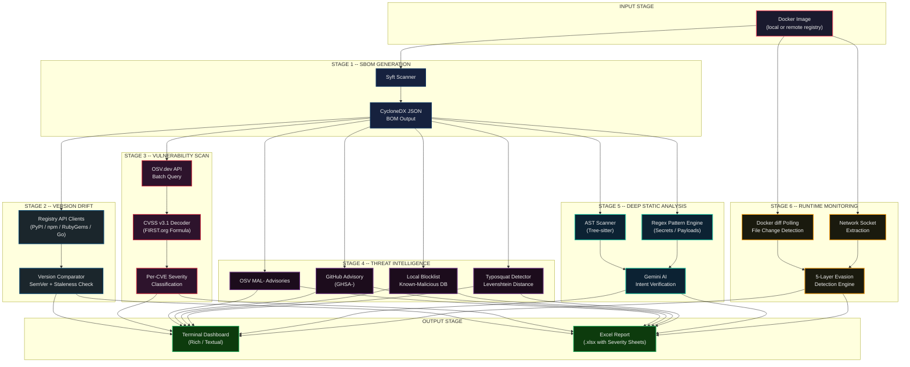

# System Overview - Complete Architecture

> **Supply Chain Sentinel** -- End-to-end software supply chain security analysis pipeline.

---

## High-Level Pipeline

The following diagram illustrates the complete processing pipeline from a Docker image input through six distinct analysis stages to the final consolidated output.

---

## Stage Descriptions

| # | Stage | Purpose | Key Technology |
|---|-------|---------|----------------|
| 0 | **Input** | Accept a Docker image (local tag or remote registry reference) as the sole entry point. | `docker`, OCI registries |
| 1 | **SBOM Generation** | Extract every software component embedded in the image filesystem layers. | [Syft](https://github.com/anchore/syft), CycloneDX JSON |
| 2 | **Version Drift Check** | Compare each discovered package version against the latest published version in its upstream registry. Flag stale or yanked releases. | PyPI JSON API, npm Registry, RubyGems API, Go Proxy |
| 3 | **Vulnerability Scan** | Query every package/version pair against the OSV.dev vulnerability database. Decode CVSS v3.1 vector strings to compute base scores and classify severity. | [OSV.dev](https://osv.dev), FIRST.org CVSS v3.1 |
| 4 | **Threat Intelligence** | Cross-reference packages against four independent malicious-package databases and detection heuristics running in parallel. | OSV MAL-, GHSA, Blocklist, Levenshtein |
| 5 | **Deep Static Analysis** | Extract package source code from the image, parse it with language-aware AST scanners, match suspicious patterns with regex, then send compact code snippets to Gemini AI for intent verification. | Tree-sitter, Regex, Google Gemini API |
| 6 | **Runtime Monitoring** | Start the container and monitor filesystem mutations and network activity in real time. Apply a 5-layer evasion detection engine to outbound connections. | `docker diff`, `docker exec`, TCP/UDP socket inspection |
| 7 | **Output** | Consolidate all findings into a colour-coded terminal dashboard and a multi-sheet Excel report with per-CVE, per-package, and summary tabs. | Rich / Textual, openpyxl |

---

## Data Flow Summary

1. A single **Docker image** enters the pipeline.
2. **Syft** produces a machine-readable **CycloneDX BOM** listing every component.
3. That BOM fans out to **four parallel analysis tracks**: version drift, vulnerability scanning, threat intelligence, and static analysis.
4. Independently, the **running container** is monitored for runtime anomalies.
5. All six tracks converge into a unified **findings model** that feeds both the terminal dashboard and the Excel report.

> [!NOTE]
> Each stage is designed to operate independently so that failures in one track (e.g., a registry API timeout) do not block the remaining analyses. Results are merged at the output stage with clear provenance indicating which engine flagged each finding.

---

## Related Documentation

| Document | Description |
|----------|-------------|
| [SBOM & Vulnerability Scanning](./02-sbom-and-vulnerability.md) | Deep dive into SBOM parsing and CVSS decoding |
| [Threat Intelligence Engine](./03-threat-intelligence.md) | Multi-database threat correlation |
| [Static Analysis & AI](./04-static-analysis-and-ai.md) | AST scanning, regex patterns, and Gemini AI verification |
| [Runtime Monitoring](./05-runtime-monitoring.md) | Live container monitoring and evasion detection |
