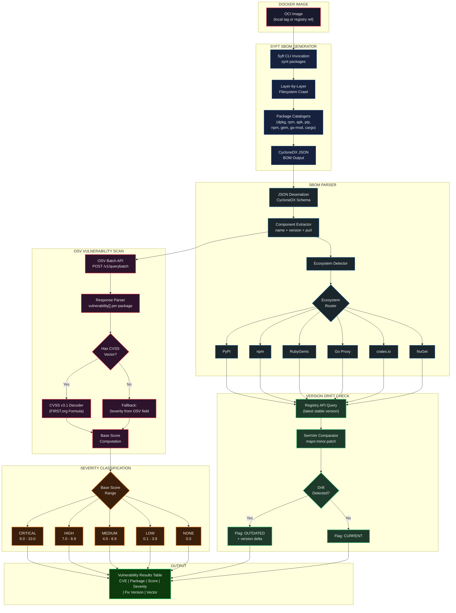

# SBOM Ingestion & Vulnerability Scanning

> Deep dive into how Supply Chain Sentinel extracts the software bill of materials and scores every known vulnerability.

[](../README.md)
[](./01-system-overview.md)

---

## Architecture Diagram



---

## Component Details

### 1. Syft SBOM Generation

Syft scans every filesystem layer of the Docker image and activates language-specific **catalogers** to detect installed packages:

| Cataloger | Detects | Source Files |
|-----------|---------|--------------|
| `dpkg` | Debian/Ubuntu packages | `/var/lib/dpkg/status` |
| `rpm` | RHEL/Fedora packages | RPM database |
| `apk` | Alpine packages | `/lib/apk/db/installed` |
| `python-pip` | Python packages | `site-packages/*.dist-info/METADATA` |
| `npm` | Node.js packages | `node_modules/*/package.json` |
| `gem` | Ruby gems | `specifications/*.gemspec` |
| `go-mod` | Go modules | `go.sum`, compiled binary metadata |
| `cargo` | Rust crates | `Cargo.lock` |

The output is a **CycloneDX v1.5 JSON** document containing a `components[]` array where each entry includes: `name`, `version`, `purl` (Package URL), `type`, and `licenses`.

### 2. Ecosystem Detection

The parser inspects each component's **purl** scheme to route it to the correct upstream registry:

| PURL Prefix | Ecosystem | Registry Endpoint |
|-------------|-----------|-------------------|
| `pkg:pypi/` | Python | `https://pypi.org/pypi/<name>/json` |
| `pkg:npm/` | Node.js | `https://registry.npmjs.org/<name>` |
| `pkg:gem/` | Ruby | `https://rubygems.org/api/v1/gems/<name>.json` |
| `pkg:golang/` | Go | `https://proxy.golang.org/<module>/@latest` |
| `pkg:cargo/` | Rust | `https://crates.io/api/v1/crates/<name>` |
| `pkg:nuget/` | .NET | `https://api.nuget.org/v3/registration5-gz-semver2/<name>/index.json` |

### 3. Version Drift Detection

For each package, the system fetches the **latest stable version** from its registry and performs a **semantic version comparison**:

- **Major drift** (e.g., `1.x` vs `2.x`) -- flagged as high-priority; potential breaking changes and missed security fixes.
- **Minor drift** (e.g., `1.2.x` vs `1.5.x`) -- flagged as moderate; may include security patches.
- **Patch drift** (e.g., `1.2.3` vs `1.2.7`) -- flagged as low; likely contains bug and security fixes.
- **Yanked versions** are detected and flagged separately as they may indicate a recalled malicious release.

### 4. OSV Vulnerability Scanning

Packages are queried against the [OSV.dev](https://osv.dev) database using the **batch API endpoint** to minimise network round trips:

```
POST https://api.osv.dev/v1/querybatch
Content-Type: application/json

{
  "queries": [
    { "package": { "name": "requests", "ecosystem": "PyPI" }, "version": "2.28.0" },
    { "package": { "name": "lodash",   "ecosystem": "npm"  }, "version": "4.17.20" }
  ]
}
```

Each matched vulnerability returns: `id` (CVE/GHSA/PYSEC), `summary`, `severity[]`, `affected[].ranges`, and optionally a **CVSS v3.1 vector string**.

---

## CVSS v3.1 Decoding

When a CVSS vector string is present (e.g., `CVSS:3.1/AV:N/AC:L/PR:N/UI:N/S:U/C:H/I:H/A:H`), the system decodes it using the **FIRST.org Base Score formula**:

### Vector Components

| Metric | Code | Values |
|--------|------|--------|
| Attack Vector | AV | Network (N), Adjacent (A), Local (L), Physical (P) |
| Attack Complexity | AC | Low (L), High (H) |
| Privileges Required | PR | None (N), Low (L), High (H) |
| User Interaction | UI | None (N), Required (R) |
| Scope | S | Unchanged (U), Changed (C) |
| Confidentiality | C | None (N), Low (L), High (H) |
| Integrity | I | None (N), Low (L), High (H) |
| Availability | A | None (N), Low (L), High (H) |

### Base Score Formula

```
ISS = 1 - [(1 - C) x (1 - I) x (1 - A)]

If Scope = Unchanged:
    Impact = 6.42 x ISS

If Scope = Changed:
    Impact = 7.52 x [ISS - 0.029] - 3.25 x [ISS - 0.02]^15

Exploitability = 8.22 x AV x AC x PR x UI

If Impact <= 0:  BaseScore = 0
Else if Scope = Unchanged:  BaseScore = Roundup(min(Impact + Exploitability, 10))
Else:  BaseScore = Roundup(min(1.08 x (Impact + Exploitability), 10))
```

> [!NOTE]
> When a vulnerability lacks a CVSS vector, the system falls back to the `severity` field provided by the OSV response and maps `CRITICAL`/`HIGH`/`MEDIUM`/`LOW` labels directly. This ensures every vulnerability receives a severity classification regardless of data completeness.

### Severity Thresholds

| Range | Label | Terminal Colour |
|-------|-------|-----------------|
| 9.0 -- 10.0 | CRITICAL | Bright Red |
| 7.0 -- 8.9 | HIGH | Red |
| 4.0 -- 6.9 | MEDIUM | Yellow |
| 0.1 -- 3.9 | LOW | Cyan |
| 0.0 | NONE | Grey |

---

## Output: Vulnerability Results Table

The final output for this stage is a structured table (rendered in the terminal and serialised to the Excel report):

| CVE ID | Package | Installed | Latest | Severity | CVSS Score | Fix Version | Vector String |
|--------|---------|-----------|--------|----------|------------|-------------|---------------|
| CVE-2023-XXXXX | requests | 2.28.0 | 2.31.0 | HIGH | 7.5 | 2.28.3 | AV:N/AC:L/... |
| GHSA-XXXX-XXXX | lodash | 4.17.20 | 4.17.21 | CRITICAL | 9.8 | 4.17.21 | AV:N/AC:L/... |

---

## Related Documentation

| Document | Description |
|----------|-------------|
| [System Overview](./01-system-overview.md) | High-level pipeline architecture |
| [Threat Intelligence](./03-threat-intelligence.md) | Multi-database malicious package detection |
| [Static Analysis & AI](./04-static-analysis-and-ai.md) | Code-level threat analysis |
| [Runtime Monitoring](./05-runtime-monitoring.md) | Live container behavioural analysis |
