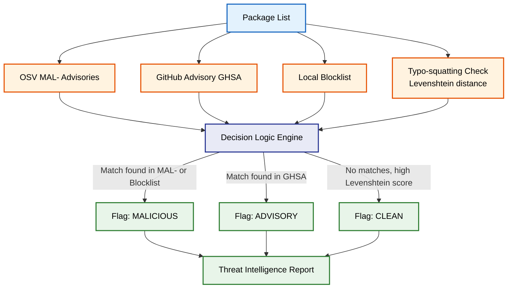

# Multi-Database Threat Intelligence Engine

[Back to Main README](../README.md)

This document outlines the Threat Intelligence engine, which cross-references identified dependencies against multiple security databases and heuristics to detect malicious packages.

## Threat Intelligence Architecture

## Databases and Detection Techniques

| Technique / Database | Description | Target Threat |
| :--- | :--- | :--- |
| **OSV MAL- Advisories** | Queries the Open Source Vulnerabilities database specifically for "MAL-" prefixes. | Known malicious packages and supply chain attacks. |
| **GHSA** | GitHub Security Advisories database integration. | Vulnerabilities and security advisories reported in GitHub. |
| **Local Blocklist** | An internal, customizable list of known bad package names, hashes, or author signatures. | Zero-day threats and organization-specific banned packages. |
| **Typo-squatting Detection** | Calculates Levenshtein distance against the top 10,000 most popular packages. | Packages masquerading as popular libraries (e.g., `reqeusts` instead of `requests`). |
