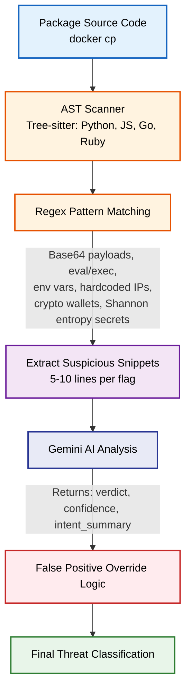

# Deep Static Analysis & AI Intent Verification

[Back to Main README](../README.md)

This document explains the 'Funnel Architecture' used for static code analysis, ending with an AI-driven intent verification step.

## Funnel Architecture Diagram

## The AI Funnel Approach

Rather than sending entire codebases to the AI, Supply Chain Sentinel utilizes a "Funnel Architecture".

### Why we don't send full code to the AI:
1.  **Cost**: Large Language Model APIs charge based on token count. Sending thousands of lines of benign code for every package is financially unscalable.
2.  **Context Window (Tokens)**: Models have maximum token limits. Large packages would exceed these limits, requiring complex chunking strategies that break semantic context.
3.  **Speed**: Processing massive prompts takes significantly longer. By isolating 5-10 lines of highly suspicious code via AST and Regex first, the AI can perform a micro-analysis in milliseconds.

The traditional static tools (AST/Regex) act as the wide end of the funnel, catching all potential anomalies. The AI sits at the narrow end, providing high-fidelity intent analysis (e.g., distinguishing between a legitimate administrative tool using `eval()` versus a malicious backdoor) to drastically reduce false positives.
