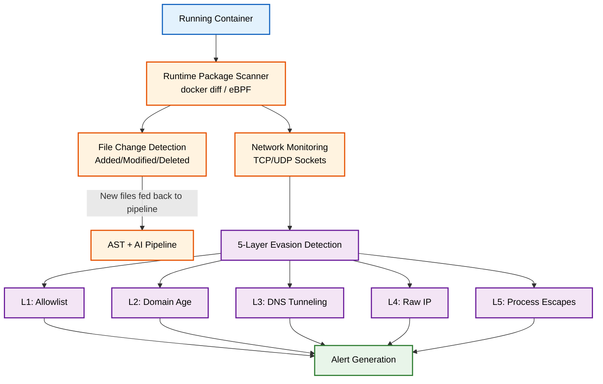

# Live Runtime Monitoring & Evasion Detection (HIDS)

[Back to Main README](../README.md)

This document describes the Host-based Intrusion Detection System (HIDS) capabilities, monitoring the container at runtime for malicious behavior and evasion techniques.

## Runtime Monitoring Architecture

## Implementation Approaches: PoC vs. Production

Supply Chain Sentinel's runtime monitoring can be deployed in two modes depending on the environment:

### Proof of Concept (PoC) Approach
*   **Mechanism**: Uses standard Docker CLI commands (`docker diff`, `docker exec`).
*   **Pros**: Highly portable, requires zero host-level configuration, works on any machine with the Docker daemon, requires no elevated kernel privileges.
*   **Cons**: Polling-based approach introduces slight latency. Misses ephemeral processes that start and die between polling intervals.

### Production Approach
*   **Mechanism**: Utilizes eBPF (Extended Berkeley Packet Filter) and direct OverlayFS monitoring.
*   **Pros**: Kernel-level visibility. Event-driven rather than polling, meaning zero-latency detection. Captures ephemeral processes and provides deep insight into syscalls.
*   **Cons**: Requires root/CAP_SYS_ADMIN privileges on the host. Kernel version dependencies. More complex deployment model.
