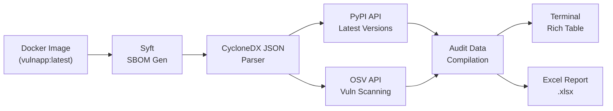

# Supply Chain Sentinel — Implementation Plan

A 3-phase cybersecurity portfolio project for Software Supply Chain Security and Runtime Threat Monitoring.

## Directory Structure (All Phases)

```
supply-chain-sentinel/
├── app/                          # Phase 1 — Vulnerable demo application
│   ├── main.py                   #   FastAPI app with intentionally outdated deps
│   ├── requirements.txt          #   Bloated, outdated dependency list
│   └── Dockerfile                #   Container definition
│
├── monitor/                      # Phases 1–3 — Core monitoring engine
│   ├── monitor.py                #   Main orchestrator (evolves each phase)
│   ├── requirements.txt          #   Monitor dependencies (evolves each phase)
│   └── utils/
│       ├── __init__.py
│       ├── config.py             #   Shared configuration constants
│       ├── sbom.py               #   Phase 1 — SBOM generation & parsing (Syft)
│       ├── pypi_client.py        #   Phase 1 — PyPI latest-version lookups
│       ├── vuln_scanner.py       #   Phase 1 — Vulnerability scanning (OSV API)
│       ├── report.py             #   Phase 1 — Excel report generator
│       ├── threat_intel.py       #   Phase 2 — Global threat intelligence (OSV)
│       ├── traffic_capture.py    #   Phase 3 — pyshark network capture
│       └── ml_engine.py          #   Phase 3 — Isolation Forest anomaly detector
│
├── dashboard/                    # Phase 3 — Streamlit real-time dashboard
│   ├── app.py
│   └── requirements.txt
│
├── ml/                           # Phase 3 — ML training & model storage
│   ├── train_model.py
│   └── models/
│
├── reports/                      # Generated Excel reports (gitignored)
├── data/                         # Training data & captured traffic
├── docker-compose.yml            # Container orchestration
├── .gitignore
└── README.md
```

---

## Phase 1: SBOM Generation & Dependency Auditing *(Current)*

### Pipeline



### Key Decisions

| Decision | Choice | Rationale |
|----------|--------|-----------|
| SBOM Tool | **Syft** | Industry-standard, CycloneDX output, fast scanning |
| SBOM Format | **CycloneDX JSON** | Machine-parseable, widely supported, rich metadata |
| Vuln Source | **OSV API** | Free, no API key, covers NVD/PyPI advisories, prepares for Phase 2 |
| Excel Engine | **openpyxl** | Supports `.xlsx` formatting, conditional styling, freeze panes |
| Terminal UX | **Rich** | Professional tables, progress bars, color-coded severity |

### Deliverables

#### [NEW] [main.py](file:///C:/Users/Vighnesh/.gemini/antigravity/scratch/supply-chain-sentinel/app/main.py)
FastAPI application with 10+ endpoints exercising all declared dependencies (crypto, data, XML, JWT, YAML, HTTP).

#### [NEW] [requirements.txt](file:///C:/Users/Vighnesh/.gemini/antigravity/scratch/supply-chain-sentinel/app/requirements.txt)
20+ packages pinned to intentionally outdated versions (mid-2021 era) to guarantee CVE hits.

#### [NEW] [Dockerfile](file:///C:/Users/Vighnesh/.gemini/antigravity/scratch/supply-chain-sentinel/app/Dockerfile)
Python 3.9-slim base, health checks, production-ready labels.

#### [NEW] [monitor.py](file:///C:/Users/Vighnesh/.gemini/antigravity/scratch/supply-chain-sentinel/monitor/monitor.py)
Main orchestrator with CLI args: `--image`, `--report-dir`, `--sbom-file`, `--skip-sbom`.

#### [NEW] Monitor utilities (`monitor/utils/`)
Modular architecture: `sbom.py`, `pypi_client.py`, `vuln_scanner.py`, `report.py`, `config.py`.

---

## Phase 2: Global Threat Intelligence & Malicious Package Detection *(Pending)*

- Enhance `monitor.py` — add threat intelligence layer (OSV advisory deep-scan)
- New `threat_intel.py` — query OSV for malicious signatures, supply chain compromises
- Append **"Malicious Flag"** column to existing Excel report
- Terminal alerts for flagged packages (colored, high-visibility)
- All Phase 1 functionality preserved

## Phase 3: ML & Traffic Behavioral Analysis *(Pending)*

- `traffic_capture.py` — pyshark network monitoring on Docker bridge
- `ml_engine.py` + `train_model.py` — Isolation Forest on packet features
- Streamlit dashboard aggregating Phases 1+2+3
- Real-time alerts for suspicious outbound connections

---

## Verification Plan

### Phase 1
1. `docker build -t vulnapp:latest ./app` — confirm image builds
2. `docker run` — confirm app serves at `:8000`
3. `syft vulnapp:latest -o cyclonedx-json` — confirm SBOM generates
4. `python monitor.py --image vulnapp:latest` — confirm full pipeline
5. Verify `.xlsx` report opens with correct columns and severity coloring
